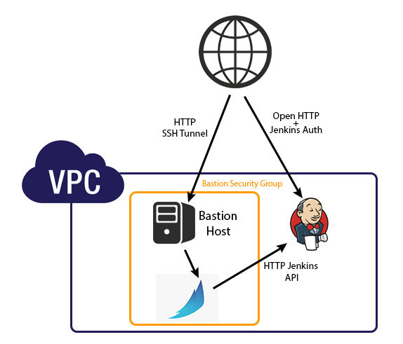

# Creating the Spinnaker VPC

## Several things to Note:
* Store your terraform state file and it's backup in a secure place. It's not a good idea to push it to a public repository.
* The script is designed to be run on the same host as where you would be creating the SSH tunnel and browsing Spinnaker from. You _CAN_ run the install from pretty much anywhere with the pre-requisites and access to the cloud provider however the tunneling instructions the script outputs will have to be modified based on where you would like to access the services from.
* Only supports AWS right now.
* Bakes only work in us-east-1 and us-west-2 (pending rosco update to handle bakes in other regions).
* These scripts are designed to be used in a fresh AWS environment where Spinnaker has never been installed due to the global nature of IAM roles. If you have manually installed Spinnaker using an existing guide there may be conflicts during setup.

## What does this do?
This is a set of terraform files and scripts designed to create a cloud environment from scratch with an example Jenkins job and Spinnaker application and pipeline.

The environment contains a Bastion host, a Spinnaker Host, and a Jenkins host.



Bastion: Default instance type: t2.micro (can be changed in terraform.tfvars). All SSH connectivity and tunnels go through this host.

Jenkins: Default instance type: t2.small (can be changed in terraform.tfvars). Where your Jenkins jobs reside, obviously.

Spinnaker: Default instance type: m4.2xlarge (can be changed in terraform.tfvars but this is the smallest recommended size due to Spinnakers memory requirements). Access to this host is tunneled/port forwarded through the bastion because it currently has no authorization or authentication available.

Other things the terraform does:
* Creates an internal DNS zone
* Creates the necessary Security Groups and IAM profiles.

## To use:
* Install Pre-Requisites. The scripts will happily complain if the pre-reqs aren't there, but who wants to hear complaining?
  * git
  * Terraform >= 0.6.8 
    * Download from https://terraform.io/downloads.html and put it in your $PATH
  * Python Modules:
    * boto >= 2.38.0
    * requests >= 2.8.1
    * json >= 2.0.9
    * docopt >= 0.6.2
  * You may need to install pip. Please consult pip install instructions specific to your OS.
* Set your AWS ENV Variables (AWS_ACCESS_KEY_ID and AWS_SECRET_ACCESS_KEY).
* generate ssh key. This should not be your default ssh key.
* Look at ./aws/terraform.tfvars and change anything you think might need changing (region, vpc_name, vpc_cidr). If these variables are not set you will be prompted for them when you run terraform.
  * set ssh_private_key_location to the filesystem location of the ssh private key you created.
  * set ssh_public_key_location to the filesystem location of the ssh public key.
  * set adm_bastion_incoming_cidrs and infra_jenkins_incoming_cidrs to a comma separated list of CIDRS that need to access these services. In general this would be the IP of the machine that is running terraform and the IP's of any machines that would need to access spinnaker & jenkins. Those two blocks could be the same.
  * Set the username and password for jenkins. 
  * for now, do not change ssh_key_name
* run the script:
```
./create_spinnaker_vpc.sh -a apply -c aws
```
-a is the terraform action to run (apply, plan, or destroy)
-c is the cloud provider you're using (aws is the only option right now)

There are two optional flags you can pass to the create_spinnaker_vpc.sh script
```
-l Tells the script to log the terraform output to a file. Location of file will be printed.
-i <path where to store tf state files>. If you don't want the tfstate files to be stored in the default location ('./')
```

You can also put 'plan' in place of 'apply', and 'terraform plan' will be run, which will show you what terraform would do if you ran apply. It's a good way to test changes to any of the .tf files as most syntax errors will be caught.

... wait 15 minutes or so ...
Pay careful attention to the output at the end, example:
```
Outputs:

   =
Bastion Public IP (for DNS): 52.34.196.173

Execute the following steps, in this order, to create a tunnel to the spinnaker and jenkins instances and an example pipeline:

1.  Configure known hosts on the bastion server:
  --- cut ---
  ssh -o IdentitiesOnly=yes -i ~/.ssh/id_rsa_spinnaker_terraform ubuntu@52.34.196.173 'ssh-keyscan -H 192.168.4.89 > ~/.ssh/known_hosts'
  --- end cut ---
    NOTE: THIS needs to be done BEFORE you can run the following tunnel command.

2.  In a separate window, start up the Spinnaker tunnel:
  --- cut ---
  ssh -o IdentitiesOnly=yes -i ~/.ssh/id_rsa_spinnaker_terraform -L 9000:localhost:9000 -L 8084:localhost:8084 -L 8087:localhost:8087 ubuntu@52.34.196.173 'ssh -o IdentitiesOnly=yes -i /home/ubuntu/.ssh/id_rsa -L 9000:localhost:9000 -L 8084:localhost:8084 -L 8087:localhost:8087 -A ubuntu@192.168.4.89' &;
  --- end cut ---

3.  In yet another separate window, start up the Jenkins tunnel:
  --- cut ---
  ssh -o IdentitiesOnly=yes -i ~/.ssh/id_rsa_spinnaker_terraform -L 9999:localhost:9999 ubuntu@52.34.196.173 'ssh -o IdentitiesOnly=yes -i /home/ubuntu/.ssh/id_rsa -L 9999:localhost:80 -A ubuntu@192.168.4.42'
  --- end cut ---

4.  Go back to the window where you ran terraform, cd to where you cloned the terraform scripts and run the following command:
  --- cut ---
  cd support ; ./create_application_and_pipeline.py -a testappname -p testappnamepipeline -g sg-4c8fbb28 -i vpc-b80335dd -v sg-478fbb23 -m sg-4d8fbb29 -n vpc_DIFFNAME -r us-west-2
  --- end cut ---

5.  Go to http://localhost:9999/ (This is Jenkins) in your browser and login with the credentials you set in terraform.tfvars.

6.  Go to http://localhost:9000/ (This is Spinnaker) in a separate tab in your browser. This is the tunnel to the new Spinnaker instance.

7.  On Jenkins, choose the job "Package_example_app" and "build now"
  NOTE: sometimes the build fails with gradle errors about being unable to download dependencies.

8.  When the Jenkins build is done, go to the spinnaker instance in your browser, select 'appname', and then 'Pipelines'. The pipeline should automatically start after the jenkins job is complete.
  It will bake an AMI, then deploy that AMI.
```

To create the Spinnaker tunnel, you need to do run the following command (from the example output above)
```
ssh -o IdentitiesOnly=yes -i ${HOME}/.ssh/id_rsa_spinnaker_terraform -L 8080:localhost:8080 -L 8084:localhost:8084 ubuntu@52.32.185.147 'ssh -o IdentitiesOnly=yes -i /home/ubuntu/.ssh/id_rsa -L 8080:localhost:80 -L 8084:localhost:8084 -A ubuntu@192.168.3.189'
```


* With the tunnel running you can go to http://localhost:9000/ to access Spinnaker.

## Creating a pipeline for the example app:
You'll see a line in the example output above that looks like this:
```
cd support ; ./create_application_and_pipeline.py -a appname -p appnamepipeline -g sg-30165d54 -v sg-31165d55 -m sg-3c165d58
```
Execute it, and it will create a pipeline in Spinnaker. This requires that your AWS ENV vars be set.

With a working pipeline, all you should have to do is go to the 'Package_example_app' job on jenkins and build it. The Spinnaker pipeline will be trigged, an Image baked, and a Server Group deployed with a Load Balancer.

# Destroying the Spinnaker VPC
Before running terraform destroy, you need to execute several manual steps to destroy the VPC that was created
* Delete any Server Groups that were created by Spinnaker. This should also terminate any instances created by Spinnaker.
* Delete any Load Balancers that were created by Spinnaker
* Delete any Launch Configurations that were created by Spinnaker
Optional:
* Deregister any Images that Spinnaker created.

If you do not do the previous steps terraform will not be able to completely destroy the VPC.

Run this command:
```
./create_spinnaker_vpc.sh -a destroy -c aws
```
Congratulations, your Spinnaker VPC is now gone!

# If you need to destroy the VPC manually (This requires the aws cli tools be installed):
* Terminate all instances in the VPC that was created.
* Delete any keypair(s) that were created by the script (the name of the keypair is set in terraform.tfvars)
* Delete the Route 53 internal zone that was created (${var.internal_dns_zone})
* Delete the VPC that was created
* Delete the IAM roles that were created. This can be done with the AWS web interface
* Delete the IAM profiles that were created. This can only be done via the CLI:
  * List the profiles:
```
set your aws environment variables, AWS_ACCESS_KEY_ID and AWS_SECRET_ACCESS_KEY
aws iam list-instance-profiles
```
  * Delete each profile listed in the previous commands output
```
aws iam delete-instance-profile --instance-profile-name <profile_name_from_the_list_above>
```

## TODO
* Remove unnecessary packages and services from the Bastion host.
* Implement GCE and other Cloud Providers
