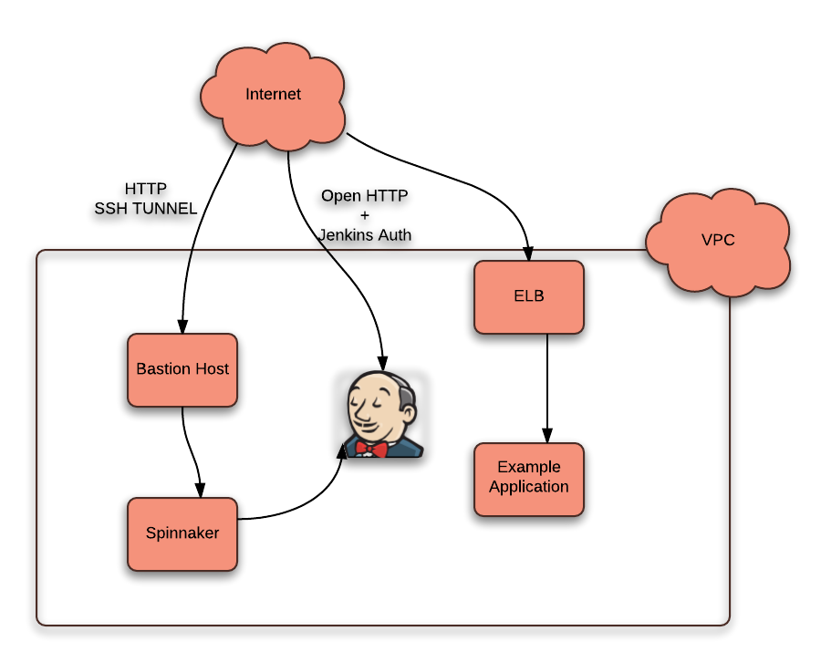

# Creating the Spinnaker VPC in AWS

## Several things to Note:
* Bakes only work in us-east-1 and us-west-2 (pending rosco update to handle bakes in other regions).
* If Spinnaker has already been installed somewhere in the account make sure the IAM roles in terraform.tfvars will not conflict with ones that may have already been created.

The environment contains a Bastion host, a Spinnaker Host, and a Jenkins host.



Bastion: Default instance type: t2.micro (can be changed in terraform.tfvars). All SSH connectivity and tunnels go through this host.

Jenkins: Default instance type: t2.small (can be changed in terraform.tfvars). Where your Jenkins jobs reside, obviously.

Spinnaker: Default instance type: m4.2xlarge (can be changed in terraform.tfvars but this is the smallest recommended size due to Spinnakers memory requirements). Access to this host is tunneled/port forwarded through the bastion because Spinnaker currently has no authorization or authentication available.

Other things the terraform does:
* Creates an internal DNS zone
* Creates the necessary Security Groups and IAM profiles.
* Creates the test application and pipeline in Spinnaker

## To use:
* Install Pre-Requisites. The scripts will happily complain if the pre-reqs aren't there, but who wants to hear complaining?
  * git
  * Terraform >= 0.6.9 
    * Download from https://terraform.io/downloads.html and put it in your $PATH
  * Python Modules:
    * boto >= 2.38.0
    * requests >= 2.8.1
    * json >= 2.0.9
    * docopt >= 0.6.2
  * You may need to install pip. Please consult pip install instructions specific to your OS.
* Set your AWS ENV Variables (AWS_ACCESS_KEY_ID and AWS_SECRET_ACCESS_KEY).
* generate ssh key. This should not be your default ssh key.
* Look at ./aws/terraform.tfvars and change anything you think might need changing (region, vpc_name, vpc_cidr). If these variables are not set you will be prompted for them when you run terraform.
  * Required:
    * Set ssh_private_key_location to the filesystem location of the ssh private key you created.
    * Set ssh_public_key_location to the filesystem location of the ssh public key.
    * Set jenkins_admin_password. Due to a bug in terraform this value must be set here.
  * Optional:
    * Set adm_bastion_incoming_cidrs and infra_jenkins_incoming_cidrs to a comma separated list of CIDRS that need to access these services. These are only necessary if you will be accessing the services from locations other than the host that is running terraform.
    * Change the value for jenkins_admin_username.
    * Change the IAM role names. IAM roles are global, so these could be changed to help prevent conflict.
  * for now, do not change ssh_key_name
* run the script:
```
./install_spinnaker.sh -a apply -c aws
```
-a is the terraform action to run (apply, plan, or destroy)
-c is the cloud provider you're using

There are two optional flags you can pass to the install_spinnaker.sh script
```
-l Tells the script to log the terraform output to a file. Location of file will be printed.
-i <path where to store tf state files>. If you don't want the tfstate files to be stored in the default location ('./')
```

You can also put 'plan' in place of 'apply', and 'terraform plan' will be run, which will show you what terraform would do if you ran apply. It's a good way to test changes to any of the .tf files as most syntax errors will be caught.

... wait 15 minutes or so ...
Pay careful attention to the output at the end, example:
```
Outputs:

   =
Bastion Public IP (for DNS): 54.201.92.140
Jenkins Public IP (for DNS): 54.213.159.191

Region: us-west-2
VPC_ID: vpc-b3506dd6
STATEPATH: /Users/tempuser/Stuff/code/Work/kenzan/internal/temploc/aws/terraform.tfstate

Execute the following steps, in this order, to create a tunnel to the spinnaker instance and an example pipeline:

1.  Start up the Spinnaker tunnel:
  --- cut ---
  cd support ; ./tunnel.sh -a start -s /Users/tempuser/Stuff/code/Work/kenzan/internal/temploc/aws/terraform.tfstate
  --- end cut ---

2.  Go to http://54.213.159.191/ (This is Jenkins) in your browser and login with the credentials you set in terraform.tfvars.

3.  Go to http://localhost:9000/ (This is Spinnaker) in a separate tab in your browser. This is the tunnel to the new Spinnaker instance.

4.  On Jenkins, choose the job "Package_example_app" and "build now"
  NOTE: sometimes the build fails with gradle errors about being unable to download dependencies. If that happens try building again.

5.  When the Jenkins build is done, go to the spinnaker instance in your browser, select 'appname', and then 'Pipelines'. The pipeline should automatically start after the jenkins job is complete.
  It will bake an AMI, then deploy that AMI.

6.  Run the following command and it will give you a URL where you can access the example app that was launched in the previous step (if it was deployed successfully):
  --- cut ---
  cd support ; ./get_lb_url.py aws testappname-teststack-testdetail 80
  --- end cut ---
  NOTE: it may take a few minutes before the instance is available in the load balancer.
```

To create the Spinnaker tunnel, you need to do run the following command (from the example output above)
```
cd support ; ./tunnel.sh -a start -s /Users/tempuser/Stuff/code/Work/kenzan/internal/temploc/aws/terraform.tfstate
```

* With the tunnel running you can go to http://localhost:9000/ to access Spinnaker.

With a working pipeline, all you should have to do is go to the 'Package_example_app' job on jenkins and build it. The Spinnaker pipeline will be triggered, an Image baked, and a Server Group deployed with a Load Balancer.

After the pipeline successfully completes run the following from the output above:
```
cd support ; ./get_lb_url.py aws testappname-teststack-testdetail 80
```
And it will tell you where to point your browser to view the example application you just deployed. It will wait until the Load Balancer is up and accepting traffic so it might take a bit of time.

# Destroying the Spinnaker VPC
Run this command:
```
./install_spinnaker.sh -a destroy -c aws
```
Congratulations, your Spinnaker VPC is now gone!

# If you need to destroy the VPC manually (This requires the aws cli tools be installed):
* Terminate all instances in the VPC that was created.
* Delete any Load Balancers that were created
* Delete any Auto Scaling Groups that were created.
* Delete any keypair(s) that were created by the script (the name of the keypair is set in terraform.tfvars)
* Delete the Route 53 internal zone that was created (${var.internal_dns_zone})
* Delete the VPC that was created
* Delete the IAM roles that were created. This can be done with the AWS web interface
* Delete the IAM profiles that were created. This can only be done via the CLI:
  * List the profiles:
```
set your aws environment variables, AWS_ACCESS_KEY_ID and AWS_SECRET_ACCESS_KEY
aws iam list-instance-profiles
```
  * Delete each profile listed in the previous commands output
```
aws iam delete-instance-profile --instance-profile-name <profile_name_from_the_list_above>
```
